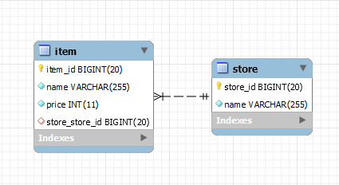

# JPA 양방향 연관관계 영속화 문제

# JPA의 연관관계

JPA는 N:N N:1 1:1 등 여러가지 연관관계를 지정 가능하며, 단방향 또는 양방향 설정이 가능하다 덕분에 복잡한 매핑과정 없이도 객체지향적으로 설계가 가능하다.

# 양방향 연관관계

JPA에서 N:1 관계를 맺기 위해선 한쪽의 Entity에만 연관관계를 지정해 주면 된다. 예를들면

```java
@Entity
public class Store{

	@Id @GeneratedValue(strategy = GenerationType.AUTO)
	@Column(name = "STORE_ID")
	private long id;
	
	@Column(nullable = false)
	private String name;
	
}
```

```java
@Entity
public class Item{

	@Id @GeneratedValue(strategy = GenerationType.AUTO)
	@Column(name = "ITEM_ID")
	private long id;
	
	@Column(nullable = false)
	private String name;
	
	@Column(nullable = false)
	private int price;
	
	@ManyToOne(fetch = FetchType.LAZY)
	private Store store;

}
```

Store와 Item 두가지 엔티티가 존재하는데

Item 엔티티에서는 Store에 대해 `@ManyToOne`을 통해서 N:1 관계를 맺었다. 단방향 매핑만으로도 연관관계가 설정이 완료 되었지만, Store 엔티티 입장에서는 객체그래프 탐색을 통해서 Item 엔티티를 가져올 수 없다.

만약 Store 엔티티에서 Item에 대해 객체 그래프 탐색이 필요할 경우 아래와 같이 설계가 가능하다

```java
@Entity
public class Store{

	@Id @GeneratedValue(strategy = GenerationType.AUTO)
	@Column(name = "STORE_ID")
	private long id;
	
	@Column(nullable = false)
	private String name;
	
	@OneToMany(mappedBy = "store", fetch = FetchType.LAZY)
	private List<Item> items = new ArrayList<>();

	// 상품 추가를 위한 메서드
	public void add(Item item) {
		this.items.add(item);
	}

}
```

List<Item> items를 선언하였고 `@OneToMany`를 통해서 1:N 관계를 맺어주었다. 이때 `mappedBy`를 지정함으로서 Item이 연관관계의 주인 (외래키를 관리하는 주체) 임을 명시하였다.



`item` 테이블에서 store_store_id 라는 외래키를 가지고 있는 것을 확인 가능하다

### 위와 같은 상태에서 영속화 과정에서의 문제를 재현해 보겠다

```java
class ItemStoreTests {

	@Autowired ItemRepository itemRepository;
	@Autowired StoreRepository storeRepository;
	
	@Test 
	@Transactional @Rollback(false)
	public void 상품입고() throws Exception{
		
		/*
		 * 엔티티 생성
		 */
		Item note = Item.builder()
				.name("노트")
				.price(1500)
				.build();
		
		Item pencil = Item.builder()
				.name("연필")
				.price(500)
				.build();
		
		Store storeA = Store.builder()
				.name("문구점")
				.build();
		
		/*
		 * 문구점에 상품 추가
		 */
		storeA.add(note);
		storeA.add(pencil);
		
		/*
		 * 추가한 상점 및 상품들 영속화 
		 */
		storeRepository.save(storeA);
		itemRepository.save(note);
		itemRepository.save(pencil);
	}
	
}
```

매우 간단한 예제이다. 노트,연필 `Item` 두개와 문구점이라는 `Store` 한개를 생성하고,

문구점에  상품 두개를 입고 시킨 뒤 모든 엔티티를 영속화 시켰다.

### 결과를 확인하자

- store 테이블 조회
    
    
    
- item 테이블 조회
    
    
    

<aside>
💡 결과가 이상하다

</aside>

`store` 객체에 `Item` 두개를 추가하고 모든 엔티티를 영속화 시켰는데, item 테이블에 FK가 Null 값으로 들어가 버렸다. 연관관계가 제대로 지정이 되지 않은채로 영속화 되어버린 것이다.

# ☝️해결방법

위 예제는 `양방향 연관관계` 라는것에 집중해야 한다.

먼저 문구점 `store`는 연관관계의 주인이 아니기 때문에 연관관계의 포인트인 FK컬럼을 영속화 시키지 않는다.

그렇다면 연필과 노트 `Item`은 FK를 관리하는 연관관계의 주인인데 왜 영속화 과정에서 값이 저장되지 않았을까?

`Item` 엔티티 입장에서 바라보면 답은 매우 간단하다. `Store`에만 `Item`을 추가했기 때문에 `Item`엔티티의 `Store`필드는 추가되지 않았고, `Item`이 영속화 되는 과정에서 `Item`이 어떤 `Store`와 연관관계를 맺은지에 대한 정보는 확인할 수가 없었던 것이다

Store 엔티티의 상품추가 메서드를 다음과 같이 수정하면 간단하게 문제가 해결된다.

```java
@Entity
public class Store{

	@Id @GeneratedValue(strategy = GenerationType.AUTO)
	@Column(name = "STORE_ID")
	private long id;
	
	@Column(nullable = false)
	private String name;
	
	@OneToMany(mappedBy = "store", fetch = FetchType.LAZY)
	private List<Item> items = new ArrayList<>();

	// 상품 추가를 위한 메서드
	public void add(Item item) {
		this.items.add(item);
		**// 상품 엔티티에도 Store 추가
		item.setStore(this);**
	}

}
```

### 결과

- store 테이블 조회
    
    
    
- item 테이블 조회
    
    
    

## 결론

JPA에서의 양방향 연관관계를 맺을 경우 **되도록 양쪽 엔티티 모두에 값을 저장** 하도록 로직을 구성하고 특히 **연관관계의 주인이 아닌쪽에서의 변동사항**은 영속화 과정에서 **연관관계 누락**이 될 여지가 있으므로 특히 주의하자.